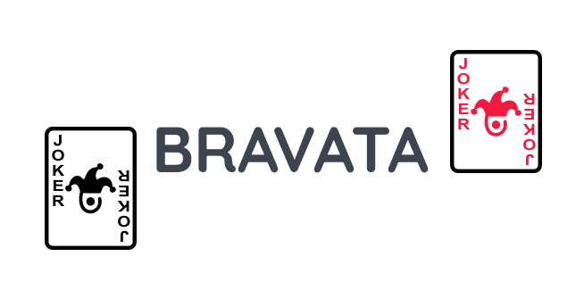

# Bravata

---

## 🎴 Introdução

**Bravata** é um jogo de cartas com apostas, inspirado em clássicos como **Canastra**, **Pôquer** e **Truco Paulista**.

- 🎮 **Jogadores:** 2 ou 4 (mano a mano ou em duplas)  
- 🏆 **Objetivo:** Melhor de 3 rodadas  
- 👥 **Classificação indicativa:** Livre  
- 💻📱 **Plataformas:** Desktop e dispositivos móveis

---

## 🎯 Objetivo do Jogo

- Vence a **partida** quem conquistar **2 rodadas**.  
- Vence a **rodada** quem acumular **1000 pontos de Prestígio**.  
- A rodada termina quando um jogador **bate** (fica sem cartas).  
- Em seguida, as cartas são redistribuídas e uma nova rodada começa.

---

## 📚 Como Jogar

### 🃏 Baralho Utilizado

O jogo usa **dois baralhos de tarô europeu** (total: **156 cartas**).

#### Cartas Comuns (56 por baralho)
- **Naipes:** Paus, Copas, Espadas e Ouros  
- **Cartas:** Ás, 2–7, Cavaleiro, Valete, Dama, Rei  
- ❌ As cartas **8, 9 e 10** são removidas  

#### Trunfos (22 por baralho)
- **Cartas numeradas:** 1–21  
- **Carta especial:** *Excuse* (O Louco / *Le Mat*)

---

### 📖 Glossário

| Termo         | Significado                                  | 
|---------------|----------------------------------------------|
| **Prestígio** | Pontos obtidos por combinações               |
| **Mão**       | Uma combinação de cartas                     |
| **Morto**     | 11 cartas extras para quem bate              |
| **Vira**      | Primeira carta revelada após distribuição    |
| **Manilha**   | Carta seguinte à vira; funciona como coringa |
| **Limpa**     | Combinação sem manilha                       |
| **Suja**      | Combinação com manilha                       |

---

### 📦 Distribuição de Cartas

1. Cada jogador recebe **11 cartas**  
2. Reserva-se um **morto** para cada jogador (1x1) ou dupla (2x2)  
3. A carta seguinte é a **vira**, que define a **manilha**  
4. Se a vira for um trunfo, revele outra até obter uma carta comum  
5. A carta seguinte inicia a **pilha de descarte**

> 🔹 Em partidas com duplas, parceiros compartilham combinações e Prestígio.

---

### 🔁 Dinâmica dos Turnos

1. **Compra uma carta** (do baralho ou descarte)  
2. Executa ações:
   - a) Jogar combinações  
   - b) Bravata!  
   - c) Correr!  
3. **Descarta uma carta**, encerrando o turno

---

#### a) Jogar Combinações

- Máximo de **3 mãos por turno**  
  - Deve **comprar uma carta** por mão (exceto ao bater)  
  - No máximo **1 mão com trunfo**  
- Pode usar cartas altas anteriores

---

#### b) Bravata!

- Faz a próxima rodada valer **1,5×**  
- Se perder, bônus vai ao adversário  
- Fica **impedido de bravatear** na rodada seguinte

---

#### c) Correr!

- Faz a próxima rodada valer **0,5×** para quem correu

---

## 🏅 Cartas Comuns: Ordem e Prestígio

| Cartas                       | Prestígio |
|------------------------------|-----------|
| 4, 5, 6, 7                   | +5        |
| Cavaleiro, Dama, Valete, Rei | +10       |
| Ás, 2, 3                     | +15       |
| **Manilha**                  | +20       |

> A **Manilha** atua como coringa. Sua ordem é irrelevante.

---

## ♠️ Combinações com Cartas Comuns

Inspiradas nas regras do pôquer:

| Combinação      | Limpa | Suja |
|-----------------|-------|------|
| Carta Alta      | 0     | 0    |
| Par             | +5    | 0    |
| Dois Pares      | +10   | +5   |
| Trinca          | +15   | +10  |
| Sequência       | +20   | +15  |
| Flush           | +25   | +20  |
| Full House      | +30   | +25  |
| Quadra          | +40   | +35  |
| Straight Flush  | +45   | +40  |
| Royal Flush     | +50   | +45  |

---

## 🃏 Trunfos: Efeitos e Prestígio

Cada trunfo possui um **efeito especial** e valor em **Prestígio**.

| Carta                  | Efeito Especial                                        | Prestígio |
|------------------------|--------------------------------------------------------|-----------|
| 0 (Excuse)             | Anula Bravata! ou Correr!                              | 0         |
| 1 (O Mago)             | Anula o Prestígio de uma combinação adversária         | +5        |
| 2 (A Sacerdotisa)      | Espia as 3 primeiras cartas do baralho                 | +5        |
| 3 (A Imperatriz)       | Compra 3 cartas                                        | +5        |
| 4 (O Imperador)        | Impede uso de trunfos pelo adversário no próximo turno | +5        |
| 5 (O Papa)             | Permite jogar +2 mãos com trunfos neste turno          | +5        |
| 6 (Os Amantes)         | Troque uma carta com o parceiro                        | +5        |
| 7 (O Carro)            | Jogue outro turno                                      | +5        |
| 8 (A Justiça)          | +50 Prestígio se o adversário estiver com mais pontos  | +10       |
| 9 (O Eremita)          | Espie a mão de um oponente                             | +10       |
| 10 (Roda da Fortuna)   | Aleatório: +100 ou -100 Prestígio                      | +10       |
| 11 (A Força)           | Permite jogar uma mão a mais                           | +10       |
| 12 (O Enforcado)       | Descarte 3 cartas                                      | +10       |
| 13 (A Morte)           | Troque sua mão com o morto                             | +10       |
| 14 (A Temperança)      | Troque 3 cartas da sua mão                             | +10       |
| 15 (O Diabo)           | Roube 3 cartas do adversário                           | +15       |
| 16 (A Torre)           | Todos descartam 3 cartas aleatórias                    | +15       |
| 17 (A Estrela)         | Multiplicador de 1,5× nas combinações deste turno      | +15       |
| 18 (A Lua)             | Ativa o efeito de um trunfo aleatório                  | +15       |
| 19 (O Sol)             | Espie a mão do parceiro                                | +15       |
| 20 (O Julgamento)      | Desmonte uma combinação em cartas altas                | +15       |
| 21 (O Mundo)           | Revive o morto                                         | +15       |

---

## 🔮 Combinações com Trunfos

- Só é permitida a combinação de **carta alta** com trunfos.

---

## 📄 Licença

Todos os direitos reservados.

---
